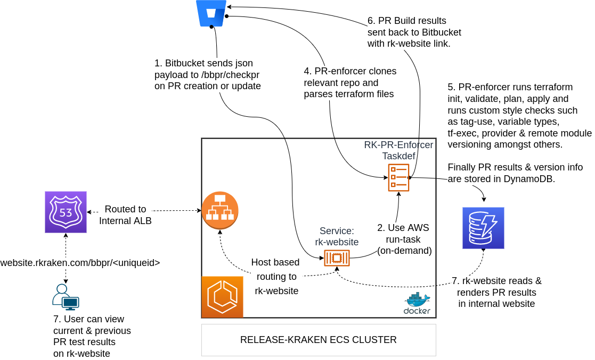
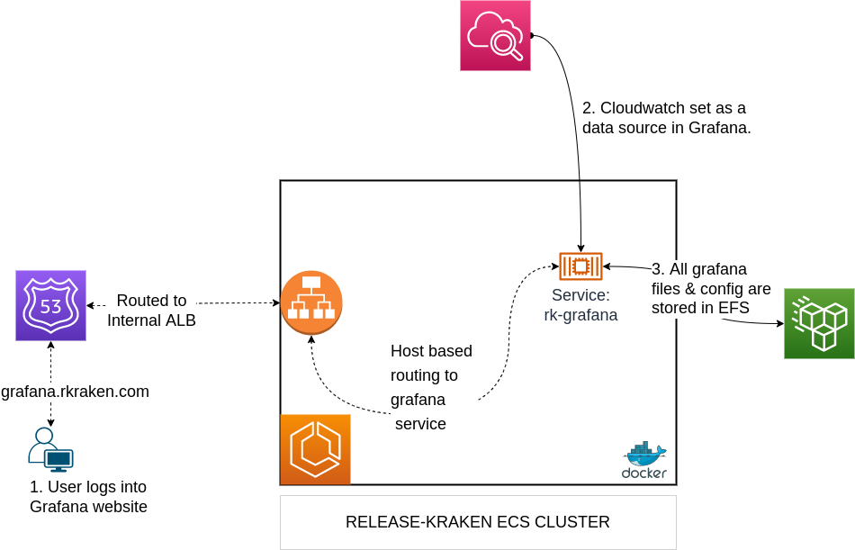

# System Architecture Examples

## Release-Kraken
#### A Centralised Multi-purpose DevOps Monitoring & Automation Suite of Tools

The release-kraken suite of tools was developed for a variety of different tasks and was used internally to improve IaC and the release process. Dockerised code was deployed to ECS to run as long running services or 'run-once' tasks.

---
### Release Page Generator

runs a taskdef once only on a 30 min cron

1. Pulls & filters this weeks JIRA releases from multiple dev teams
2. Displays issues left to do in that release 2/8
3. Consults data-store for mapped bamboo jobs for that particular release  - publishes the current version that is deployed to (UAT & PROD)

use python requests & bs4

auto-updates every 30 mins

https://github.com/drmonkeysee/ecs-scheduler = runs on cron

---
### Cloudwatch Alerter

I created a Terraform remote module that has a variety of alert types configured. e.g.

1. Lambda - error rate (%)
2. Duration
3. Memory
4. API Gateway 4xx/5xx
5. ECS Cluster (Memory & CPU)

Various consumers could feed in the names of what they had created into the remote module so that alerts would be (re)provisioned for that resource every time it was (re)deployed.

I also created an alert client that could send alerts to any arbitrary MS Teams channel. The client also created a graph depicting the error that triggered teh alert via the `GetMetricWidgetImage` API

---
### Terraform PR Enforcer

Tests PR merges for errors:
1. Checks all code entry points in repo (not just the modified state files) by running terraform init, validate and plan.
2. Enforces minimum provider version. e.g. AWS provider must be > 4.0.0
3. Enforces minimum terraform exe version. e.g. terraform binary must be > 1.0.0
4. Checks all variables have types and types.
5. Runs terraform fmt
6. Ensures README.md files are created using terraform-docs
7. Ensure consumers are using s3 backed remote state
8. Ensures remote modules, terraform exe and aws providers are pinned to the correct semantic version.

---
### Terraform Module Manger

This application provides a management view on the state of multiple remote modules, consumers and their environments. It gives an overview on:

1.
TBD

---
### ECR Security Scanner

This app was written to highlight potential security issues with developer written Dockerfiles. It accomplished the following:

1. Switch on 'immutable tags' on misconfigured ECR repos
2. Switch on 'scan on push' on misconfigured ECR repos
3. Run a weekly security scan check and publish Critical/High CVE scan results to MS Teams and confluence

If this visibility was not provided it would be likely that app container versions would not be update and vital security patches would remain unapplied.

---
### Bamboo Permission Enforcer
TBD

---
### Grafana visualiser

This service provides Grafana with AWS Cloudwatch as a data source. It is useful because specific AWS IAM permissions do not need to be created or maintained. The dashboards that can be created are much nicer than the ones CloudWatch provides and the service can also be across multiple AWS accounts.

---
### EC2 Tag Enforcer
TBD

