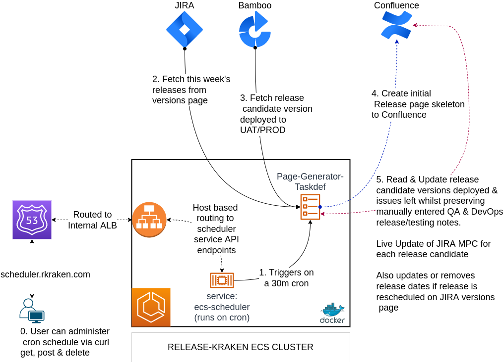

# System Architecture Examples

## Release-Kraken - Multi-purpose DevOps Automation Tool

https://github.com/drmonkeysee/ecs-scheduler = runs on cron

runs a taskdef once only on a 30 min cron

1. Pulls & filters this weeks JIRA releases from multiple dev teams
2. Displays issues left to do in that release 2/8
3. Consults data-store for mapped bamboo jobs for that particular release  - publishes the current version that is deployed to (UAT & PROD)

use python requests & bs4

auto-updates every 30 mins

### Release Page Generator

### Cloudwatch Alerter

### Terraform Module Manger

### Terraform PR Enforcer

### EC2 Tag Enforcer

### ECR Security Scanner

### Bamboo Permission Enforcer

